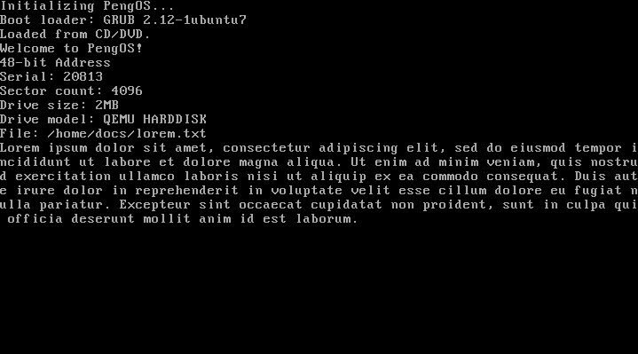

# Penguin OS

Developed in C++ and NASM-style Assembly.

## Requirements

### Windows
- Windows SubSystem (WSL)

## How to run

### Linux

1. Run `bash build_cross_compiler.sh`.
2. Run `build.sh`.

### Windows

1. Open a new Command Prompt window.
2. `cd` to the location of this repository.
3. Enter `wsl`.
4. Run `bash build_cross_compiler.sh`.
5. Run `build.sh`.

## Development Progress
- [x] Boot
- [x] Terminal
- [x] GDT
- [x] IDT
- [x] Keyboard
- [x] Timer
- [ ] System Calls
  - [x] Basic implementation
  - [ ] Memory (malloc, free, realloc)
- [x] Paging
- [x] Simple memory management (kmalloc/kfree)
- [ ] Data Types
  - [x] std::string (called String)
  - [x] std::vector (called Array)
  - [ ] std::map (called Map)
  - [x] std::list (called LinkedList)
  - [x] std::queue (called Queue)
- [ ] File System
  - [ ] FAT32
    - [x] Read
    - [ ] Write
    - [ ] Open/Close lock
    - [ ] File stream
  - [ ] NTFS
    - [ ] ???
- [ ] Stack trace dump on error/panic
- [x] Shell
- [ ] Graphical Display
- [ ] Scheduling
  - [x] Create process
  - [x] Switch process
  - [ ] Kill process